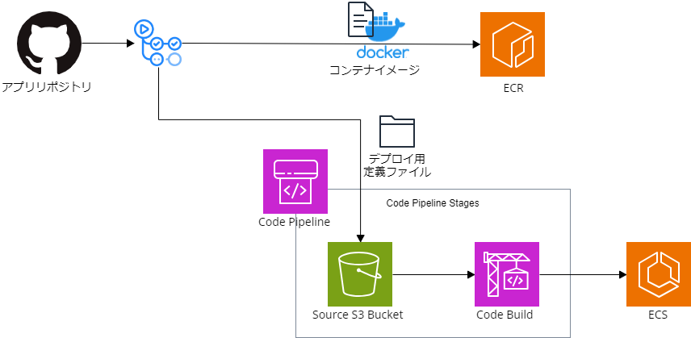

# デプロイパイプライン説明

## 概要

このディレクトリには、アプリを AWS 環境へデプロイするために必要な設定ファイル、スクリプトを格納しています。  
アプリは、GitHub Actions・AWS CodePipeline を利用して ECS にデプロイされます。

アプリケーションは、デプロイスクリプトを実行することで、AWS 上にデプロイすることができ、ワークフローでも、このデプロイスクリプトを実行してデプロイを行います。  
スクリプトでは、ECR へイメージを push し、[/aws/config](/aws/config/) 配下の設定ファイルを zip に圧縮したあと S3 へアップロードする処理を行っています。  
S3 へ設定ファイルがアップロードされると、 AWS アカウント上の AWS CodePipeline が実行され、ECS へアプリがデプロイされます。

## システム構成図

デプロイパイプラインのシステム構成図を以下に示します。



## ECS 設定ファイルについて

[/aws/config](/aws/config) の設定ファイルでは、ECS のスペック等の設定を管理しています。  
ECS の CPU・メモリサイズを変更したい場合は、[/aws/config/ecs-task-def.json](/aws/config/ecs-task-def.json) の `cpu`, `memory` の項目の値を変更してください。

## デプロイ方法

デプロイスクリプトをローカルで実行する場合のデプロイ方法を示します。  
デプロイしたいアカウントの認証情報をターミナルに設定してから実行してください。

```bash
# このリポジトリのルートディレクトリにいる想定
bash ./aws/scripts/deploy.sh <stg or prd> <frontend or backend> <build context> <dockerfile path>
# 例:
# bash ./aws/scripts/deploy.sh stg frontend ../hinagiku-renewal/frontend ../hinagiku-renewal/frontend/Dockerfile
```
